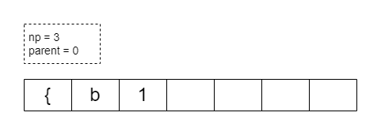
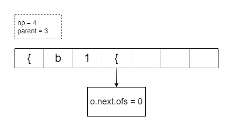
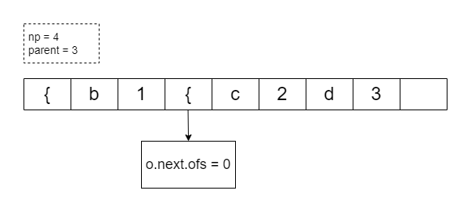
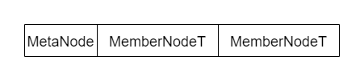
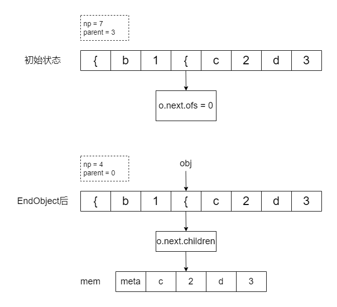

# SAXHandler解析

## 简介

SAXHandler负责处理解析json过程中的发生的事件，并将解析结果保存到自身的节点数组(st)中。

## 解析

### 成员变量

其成员变量的定义如下：
```C++
// 指向当前节点数组的指针，用于存储解析后的json数据
NodeType* st_{nullptr};
// 当前节点数组的节点数目
size_t np_{0};
// 节点数组的容量
size_t cap_{0};
// 当前节点的父节点在节点数组的索引
size_t parent_{0};
// 分配器指针，用于分配内存
Allocator* alloc_{nullptr};
```

这里我们主要关注的是st、np和parent。alloc可以理解为C++默认的内存分配器。

NodeType一般情况下是DNode，位于dynamicnode.h中，或者可以简单理解为GenericNode，因为DNode并没有额外的成员变量，只是多了一些操作底层数据的函数。

### 成员函数

#### SetUp与TearDown

这一对函数主要用于申请和释放节点数组的内存。sax会在一开始就根据需要解析的json字符串大小申请足够的空间。

#### 添加节点

##### 普通类型

sonic-cpp支持的普通类型有null、bool、uint、int、double。分别对应成员函数中的Null()、Bool()等。

普通类型的节点添加流程相似，都是先np++，再使用placement_new将值构造到指定的地址。

##### 字符串类型

对应成员函数中的String，调用stringImpl将string_view类型的变量添加到st中。

添加的过程与普通类型也类似，只不过会多一个设置长度的步骤。

设置长度的步骤位于genericnode.h中的setLength，具体可见讲解GenericNode的一章。

##### 容器类型（Object与Array）

这两个类型的操作方式基本类似，这里只分析Object。

###### StartObject

定义：

```c++
bool StartObject() noexcept
{
    SONIC_ADD_NODE();
    NodeType* cur = &st_[np_ - 1];
    cur->o.next.ofs = parent_;
    parent_ = np_ - 1;
    return true;
}
```

为了方便理解，我们用图片来表示。

我们有一个待解析的json字符串。

```json
{"a":1, "b":{"c":2,"d":3}}
```

现在已经解析到`b`，那么此时的st中存储的数据应该如下所示：



接着解析到`{`，调用StartObject函数，先np++，然后设置st[n-1]和parent的值。执行完毕后如下图所示：



假设我们之后又添加了一些键值对，如下所示。



###### EndObject

为了理解EndObject，我们先来看一些里面用到的函数。

```C++
template<typename T>
void* containerMalloc(size_t cap, Allocator& alloc)
{
    size_t alloc_size = cap * sizeof(T) + sizeof(MetaNode);
    void* mem = alloc.Malloc(alloc_size);
    // init MetaNode
    auto* meta = static_cast<MetaNode*>(mem);
    new(meta) MetaNode(cap);

    return mem;
}

template<typename NodeType>
class MemberNodeT
{
public:
    const NodeType name;
    NodeType value;
};
```

在Object的情况下，这里的T会是MemberNodeT类型，正好存储一个kv对的key和value。NodeType上面提到过，就是GenericNode。

假设cap为2，那么containerMalloc就是申请了一个大小为MetaNode+2*MemberNodeT的空间，并将MetaNode的位置用cap初始化。



EndObject定义如下，为了便于理解将一些函数做了替换。

```C++
bool EndObject(uint32_t pairs)
{
    NodeType& obj = st_[parent_];
    size_t old = obj.o.next.ofs;
    obj.setLength(pairs, kObject);
    if (pairs)
    {
        void* mem = obj.template containerMalloc<MemberType>(pairs, *alloc_);
        obj.setChildren(mem);
        std::memcpy((void*) obj.getObjChildrenFirstUnsafe(), (void*) (&obj + 1), pairs * sizeof(MemberType));
    }
    else
    {
        obj.setChildren(nullptr);
    }
    np_ = parent_ + 1;
    parent_ = old;
    return true;
}
```

这里的pairs指的是当前Object中键值对的个数，当前有`"c": 2`、`"d": 3`，因此pairs的值为2。

containerMalloc的作用刚刚讲过，就是根据pairs申请一段内存空间。setChildren(mem)的作用就是将obj的children指向mem，也就是刚刚申请的内存。可以看到children并没有指向key或value的节点，而是指向了MetaNode。

obj.getObjChildrenFirstUnsafe()函数返回的是obj的children跳过MetaNode后的地址，也就是第一个有意义的节点。

std::memcpy(dest, src, n)的作用是从src复制n个字节的数据到dest中。

在C++中，以下的操作是可行的：

```C++
struct A
{
	int a;
	int b;
	A(int x, int y) :a(x), b(y) {}
};

int main()
{
	int* arr = new int[10];
	A a(123, 234);
	std::memcpy(arr, &a, sizeof(a));	// arr[0] = 123, arr[1] = 234
	return 0;
}
```

通过直接操作内存的方式可以高效地将数据进行复制。

总结以下EndObject的流程：

1. 根据pairs申请一段内存空间mem
2. 将st[parent]的children指向mem
3. 将st[parent]之后的内容复制到mem中

示意图：



此时st中的`c`、`2`等值不会被删除，但是由于np已经重新设置为4，因此之后解析的节点会覆盖掉`c`，`2`。


