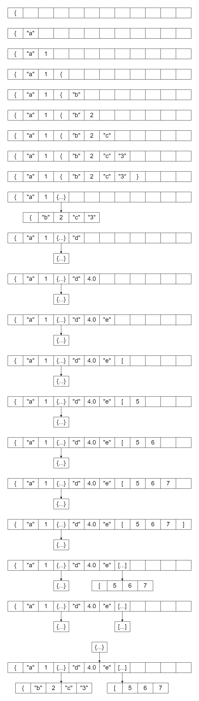

# json解析主要流程分析

## 简介

本文通过宏观角度分析sonic-cpp进行json解析的流程。

## 辅助工具

### 辅助类

在json解析的过程中主要用到了两个辅助类：[Parse](https://github.com/bytedance/sonic-cpp/blob/master/include/sonic/dom/parser.h)和[SAXHandler](https://github.com/bytedance/sonic-cpp/blob/master/include/sonic/dom/handler.h)。
其中Parser负责解析字符串，触发与处理对应的事件；而SAXHanlder负责存储解析后的结果。

### 辅助函数

- SkipSpace()。用于忽略空格与换行符找到下一个字符。
- parseStrInPlace(sax)。用于解析两个双引号之间的字符串，一般只在遇到`"`后使用，例如对于字符串`"abc"`，在遇到第一个`"`后调用parseStrInPlace(sax)函数，即可在sax的下一个位置保存`abc`，注意没有保存引号。
- parseNumber(sax)。用于解析数字，包括整数和浮点数，在sax中新增一个节点并保存解析的结果。
- EndObject()。当解析完一个Object后调用EndObject()，会申请一片新的空间来存放解析完的Object，由父节点的children指向这片空间。具体流程可参考[SAXHandler](./SAXHandler.md)中的解析。
- EndArray()。与EndObject类似的流程。

## 流程分析

接下来我们以一个具体的例子来理解sonic-cpp是如何将一个字符串逐步解析并保存到SAXHandler中的。

我们有一个测试用的json：

```json
{
    "a": {
        "b": 114514,
        "c": "114514"
    },
    "d": 1.23456,
    "e": [
        19,
        198,
        10
    ]
}
```

这个json包含了基本类型、嵌套对象(bc)、数组(e)，基本涵盖了解析的所有场景。

解析的主要函数位于parse.h中的[parseImpl](https://github.com/bytedance/sonic-cpp/blob/master/include/sonic/dom/parser.h#L523)函数。

0. 最开始会初始化一个depth数组，用于存储当前解析的数组元素个数或object的个数。

    ```C++
    sax:{
        np = 0  // np表示当前的节点个数
        parent = 0  // 表示父节点的位置
    }
    depth = {}
    ```

1. parser遇到了最外面的`{`，这说明了一个子节点的开启，此时会调用sax.StartObject()来增加容量，并记录父节点的位置，同时向depth中插入一个Object的标识。处理后的结果如下：

    ```C++
    sax:{
        np = 1
        st[0]->o.next.ofs = 0   // 语法角度这里应该是.而不是->，用->是为了更清晰一些
        parent = 0  // 此时的父节点下标为0
    }
    depth = {0}
    ```

2. 通过SkipSpace语句解析到下一个字符是`"`，随后通过goto语句跳转到obj_key的位置，通过辅助函数parseStrInPlace得到第一个key的值为`a`，并将其加入到sax中。此时的sax：

    ```C++
    sax:{
        np = 2
        st[1]->sv.len = 260
        st[1]->sv.p = "a"
        parent = 0
    }
    depth = {0}
    ```

3. 解析完毕后继续解析下一个字符，为`:`，符合预期，再解析下一个字符为`{`，继续调用sax.StartObject()来开始一个新的对象，同时depth添加一个新的元素，意味着开始了一个新的Object。

    ```C++
    sax:{
        np = 3
        st[2]->o.next.ofs = 0
        parent = 2  // 表示此时的父节点下标为2
    }
    depth = {0, 0}
    ```

4. 再继续解析，遇到`"`，和第2步一样调用parseStrInPlace获取到key值为`b`。

    ```C++
    sax:{
        np = 4
        st[3]->sv.len = 260
        st[3]->sv.p = "b"
        parent = 2
    }
    depth = {0, 0}
    ```

5. 解析完key之后解析value，遇到了数字1，因此调用parseNumber(sax)解析数字，得到114514，并保存到sax。每解析完一个键值对，对应的depth.back()都会加1

    ```C++
    sax:{
        np = 5
        st[4]->n.t = 3
        st[4]->n.i64 = 114514
        parent = 2
    }
    depth = {0, 1}  // 这里从{0,0}变成{0,1}
    ```

6. 解析完之后继续解析下一个key，key的值为`c`。

    ```C++
    sax:{
        np = 6
        st[5]->sv.n = 260
        st[5]->sv.p = "c"
        parent = 2
    }
    depth = {0, 1}
    ```

7. 重复流程解析value，这里value是字符串类型，调用parseStrInPlace。

    ```C++
    sax:{
        np = 7
        st[6]->sv.n = 260
        st[6]->sv.p = "114514"
        parent = 2
    }
    depth = {0, 2}  // 又解析完一个节点，此处的depth.back()又加1
    ```

8. 解析完`b`和`c`后遇到了`}`，调用sax.EndObject()来结束一个Object。EndObject有一个参数`pairs`，表示这个Object有多少个节点。关于EndObject的流程可查看此处。这里解析完了一个子节点，因此depth也会有相应的改变。

    ```C++
    sax:{
        np = 3
        st[2]->o.next.children = {Object, "b": 114514, "c": "114514"}   // children指向的是Object的开始
        parent = 0
    }
    depth = {1} // 先pop_back再back()+1
    ```

9. 继续下一个键值对的解析。

    ```C++
    // 遇到key
    sax:{
        np = 4
        st[3]->sv.n = 260
        st[3]->sv.p = "d"
        parent = 0
    }
    depth = {1}

    // 遇到value
    sax:{
        np = 5
        st[4]->n.t = 19
        st[4]->n.f64 = 1.23456
        parent = 0
    }
    depth = {2}
    ```

10. 进行下一个键值对的解析，遇到key常规操作。

    ```C++
    sax:{
        np = 6
        st[5]->sv.len = 260
        st[5]->sv.p = "e"
        parent = 0
    }
    depth = {2}
    ```

11. 这里遇到了`[`，意味着一个数组的开始，会调用sax.StartArray，然后depth添加一个值。

    ```C++
    sax:{
        np = 7
        st[6]->o.next.ofs = 0
        parent = 6
    }
    depth = {2, 1ull<<31}   // 数组的mask从1ull<<31开始，而不是0
    ```

12. 接下来开始arr_val的解析。过程与第5步的过程相似，这里合并在一起。

    ```C++
    // 19
    sax:{
        np = 8
        st[7]->n.t = 3
        st[7]->n.i64 = 19
        parent = 6
    }
    depth = {2, 1ull<<31 + 1}

    // 198
    sax:{
        np = 9
        st[8]->n.t = 3
        st[8]->n.i64 = 198
        parent = 6
    }
    depth = {2, 1ull<<31 + 2}

    // 10
    sax:{
        np = 10
        st[9]->n.t = 3
        st[9]->n.i64 = 10
        parent = 6
    }
    depth = {2, 1ull<<31 + 3}

    ```

13. 遇到`]`，数组解析完毕，调用sax.EndArray()，并进行depth的pop_back()。

    ```C++
    sax:{
        np = 7
        st[6]->o.next.children = [Array, 19, 198, 10]
        parent = 0
    }
    depth = {3} // 解析完e和对应的数组，back()++
    ```

14. 遇到最后一个`}`，调用sax.EndObject

    ```C++
    sax:{
        np = 1
        st[0]->o.next.children = {Object, a, {...}, d, 1.23456, e, [...]}
        parent = 0
    }
    depth = {} // 解析完e和对应的数组，back()++
    ```

15. 此时depth为空，解析完毕

以下是解析过程的图片版，为图片美观所有数字字符串都保持在个位数，不影响理解。


